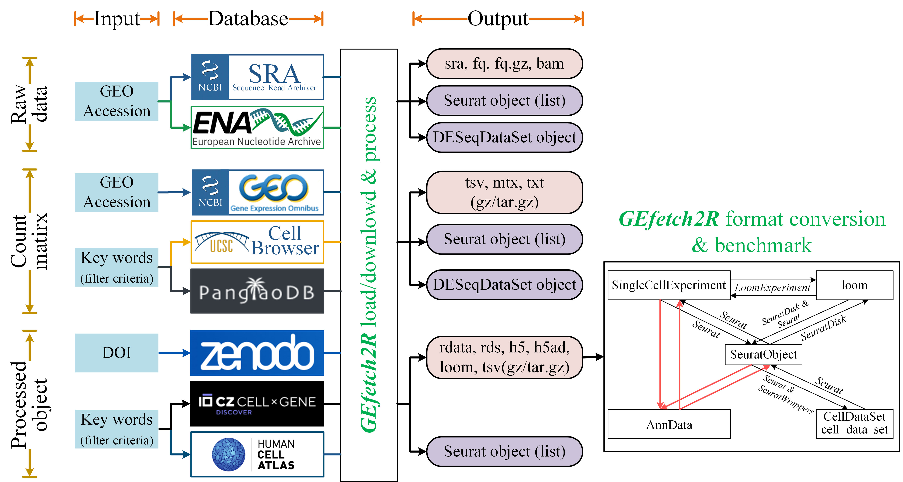

# *GEfetch2R* - Access Single-cell/Bulk RNA-seq Data from Public Repositories and Benchmark the Subsequent Format Conversion Tools


[](https://cran.r-project.org/web/licenses/GPLv3)
[](https://github.com/showteeth/GEfetch2R)

## Introduction

`GEfetch2R` is designed to accelerate users' downloading and preparation of single-cell/bulk RNA-seq datasets from public resources. It can be used to:

For **bulk RNA-seq**:

* Download **raw data (`sra/fastq/bam`)** from `SRA/ENA` with **GEO accessions**:
  * **Parallel** download `sra/fastq/bam` files from `ENA`
  * **Support Aspera** (`ENA`)
  * **Parallel** split `sra` to `fastq` files
  * **Convert `bam` to `fastq` files**
  * **Mapping with `STAR` and load the output to `DESeq2`**
* Download **count matrix** from `GEO` with **GEO accessions**:
  * **Generate count matrix from supplementary files**
  * **Load the count matrix to `DESeq2`**

For **scRNA-seq**:

* Download **raw data (`sra/fastq/bam`)** from `SRA/ENA` with **GEO accessions**:
  * **Parallel** download `sra/fastq/bam` files from `ENA`
  * **Foramt downloaded `fastq` files** to standard style that can be identified by 10x softwares (e.g. `CellRanger`).
  * **Support Aspera** (`ENA`)
  * **Parallel** split `sra` to `fastq` files
  * **Download original 10x generated `bam` files (with custom tags)**
  * **Convert `bam` to `fastq` files (`samtools/bamtofastq_linux`)**
  * **Mapping with `STAR/CellRanger` and load the output to `Seurat`**
* Download **count matrix**:
  * Download **count matrix** from `GEO` with **GEO accessions**
  * Download **count matrix** and **annotation (e.g. cell type)** information from `PanglanDB` and `UCSC Cell Browser` with **key words (filter criteria)**
  * **Extract subset with annotation and gene (`PanglanDB` and `UCSC Cell Browser`)**  
  * **Load the count matrix and annotation to `Seurat`**
* Download **processed object**:
  * Download **processed object** from `Zenodo` with **DOI**
  * Download **processed object** from `CELLxGENE` and `Human Cell Atlas` with **key words (filter criteria)**
  * **Parallel** download
  * **Extract subset with annotation and gene (`CELLxGENE`)**
  * **Load the processed object (`rds`) to `Seurat`**
* **Format conversion and benchmark related tools**:
  * **Format conversion between widely used single cell objects** (`SeuratObject`, `AnnData`, `SingleCellExperiment`, `CellDataSet/cell_data_set` and `loom`)
  * **Benchmark the tools (more than two tools available for the conversion)**:
    * `SeuratObject` to `AnnData`: `SeuratDisk`, `sceasy`, `scDIOR`
    * `SingleCellExperiment` to `AnnData`: `sceasy`, `scDIOR`, `zellkonverter`
    * `AnnData` to `SeuratObject`: `SeuratDisk`, `sceasy`, `scDIOR`, `schard`
    * `AnnData` to `SingleCellExperiment`: `schard`, `scDIOR`, `zellkonverter`

<hr />

## Framework

<div align="center">

</div>

<hr />

## Installation

To install `GEfetch2R`, start R and enter:
```R
# install via CRAN
install.packages("GEfetch2R") # coming soon

# you can also install the development version from GitHub
# install.packages("devtools")
devtools::install_github("showteeth/GEfetch2R")
```

There are some conditionally used packages:

```R
# install.packages("devtools") #In case you have not installed it.
devtools::install_github("alexvpickering/GEOfastq") # download fastq
install.packages('tiledbsoma', repos = c('https://tiledb-inc.r-universe.dev', 'https://cloud.r-project.org')) # download from CELLxGENE
install.packages('cellxgene.census', repos=c('https://chanzuckerberg.r-universe.dev', 'https://cloud.r-project.org')) # download from CELLxGENE
devtools::install_github("cellgeni/sceasy") # format conversion
devtools::install_github("mojaveazure/seurat-disk") # format conversion
devtools::install_github("satijalab/seurat-wrappers") # format conversion
devtools::install_github('theislab/zellkonverter@7b118653a471330b3734dcfee60c3537352ecb8d', upgrade = 'never') # format conversion
devtools::install_github('cellgeni/schard', upgrade = 'never') # format conversion
devtools::install_github('JiekaiLab/dior', upgrade = 'never')  # format conversion
```

**For possible issues about installation, please refer `INSTALL.md`.**

For data structures conversion and downloading fastq/bam files, `GEfetch2R` requires additional tools, you can install with:

``` bash
# install additional packages for format conversion
pip install diopy
conda install -c bioconda loompy anndata 
# or
pip install anndata loompy

# install additional packages for downloading fastq/bam files
conda install -c bioconda 'parallel-fastq-dump' 'sra-tools>=3.0.0'

# install bamtofastq, the following installs linux version
wget --quiet https://github.com/10XGenomics/bamtofastq/releases/download/v1.4.1/bamtofastq_linux && chmod +x bamtofastq_linux

# install ascp
conda install -c hcc aspera-cli -y
# ascp path: ~/miniconda3/bin/ascp (path/bin/ascp)
# private-key file : ~/miniconda3/etc/asperaweb_id_dsa.openssh (path/etc/asperaweb_id_dsa.openssh)
```

<hr />

## Docker
We also provide a [docker image](https://hub.docker.com/repository/docker/soyabean/GEfetch2R) to use:

```bash
# pull the image
docker pull soyabean/GEfetch2R:1.6

# run the image
docker run --rm -p 8888:8787 -e PASSWORD=passwd -e ROOT=TRUE -it soyabean/GEfetch2R:1.6
```

**Notes**:

* After running the above codes, open browser and enter `http://localhost:8888/`, the user name is `rstudio`, the password is `passwd` (set by `-e PASSWORD=passwd`)
* If port `8888` is in use, change `-p 8888:8787`
* The `conda.path` in `ExportSeurat` and `ImportSeurat` can be set `/opt/conda`.
* The **sra-tools** can be found in `/opt/sratoolkit.3.0.6-ubuntu64/bin`.
* The `parallel-fastq-dump` path: `/opt/conda/bin/parallel-fastq-dump`.
* The `bamtofastq_linux` path: `/opt/bamtofastq_linux`.
* The `samtools` path: `/opt/conda/bin/samtools`.
* The `STAR` and `Cell Ranger` is not available in the image because customized reference genome is required.

<hr />

## Vignette
Detailed usage is available in [website](https://showteeth.github.io/GEfetch2R/):

* [Download raw data](https://showteeth.github.io/scfetch/articles/DownloadRaw.html)
* [Download count matrix and annotaion](https://showteeth.github.io/scfetch/articles/DownloadMatrices.html)
* [Download processed data](https://showteeth.github.io/scfetch/articles/DownloadObjects.html)
* [Format conversion and benchmark](https://showteeth.github.io/scfetch/articles/ObjectConversion.html)

<hr />

## Comparison with similar tools

<div align="center">

</div>

<hr />

## Usage
### Download raw data (sra/fastq/bam)

> `GEfetch2R` supports downloading raw data (`sra/fastq/bam`) from `SRA` and `ENA` with **GEO accessions**. In general, downloading raw data from ENA is much faster than SRA, because of `ascp` and **parallel** support.

Since the downloading process is time-consuming, we provide the commands used to illustrate the usage.

#### Extract all samples (runs)

For `fastq` files stored in `SRA/ENA`, `GEfetch2R` can extract sample information and run number with **GEO accessions** or users can also **provide a dataframe contains the run number of interested samples**.

Extract all samples under `GSE130636` and the platform is `GPL20301` (use `platform = NULL` for all platforms):
```r
GSE130636.runs <- ExtractRun(acce = "GSE130636", platform = "GPL20301")
```

<hr />

#### Download sra

With the dataframe contains gsm and run number, `GEfetch2R` will use `prefetch` to download `sra` files from `SRA` or using `ascp/download.file` to download `sra` files from `ENA`. The returned value is a dataframe contains failed runs. If not `NULL`, users can re-run `DownloadSRA` by setting `gsm.df` to the returned value.

Download from `SRA`:
```r
# a small test
GSE130636.runs <- GSE130636.runs[GSE130636.runs$run %in% c("SRR9004346", "SRR9004351"), ]
# download, you may need to set prefetch.path
out.folder <- tempdir()
GSE130636.down <- DownloadSRA(
  gsm.df = GSE130636.runs,
  out.folder = out.folder
)
# GSE130636.down is null or dataframe contains failed runs
```

Download from `ENA` (**parallel**):
```r
out.folder <- tempdir()
# download from ENA using download.file
GSE130636.down <- DownloadSRA(
  gsm.df = GSE130636.runs, download.method = "download.file",
  timeout = 3600, out.folder = out.folder,
  parallel = TRUE, use.cores = 2
)

# download from ENA using ascp
GSE130636.down <- DownloadSRA(
  gsm.df = GSE130636.runs, download.method = "ascp",
  ascp.path = "/path/to/ascp", max.rate = "300m",
  rename = TRUE, out.folder = out.folder,
  parallel = TRUE, use.cores = 2
)

# GSE130636.down is null or dataframe contains failed runs
```

The `out.folder` structure will be: `gsm_number/run_number`.

<hr />

#### Download fastq

##### Split sra to generate fastq

After obtaining the `sra` files, `GEfetch2R` provides function `SplitSRA` to split `sra` files to fastq files using `parallel-fastq-dump` (**parallel, fastest and gzip output**), `fasterq-dump` (**parallel, fast but unzipped output**) and `fastq-dump` (**slowest and gzip output**).

For fastqs generated with 10x Genomics, `SplitSRA` can identify read1, read2 and index files and format the read1 and read2 to 10x required format (`sample1_S1_L001_R1_001.fastq.gz` and `sample1_S1_L001_R2_001.fastq.gz`). In detail, the file with read length 26 or 28 is considered as read1, the files with read length 8 or 10 are considered as index files and the remain file is considered as read2. The read length rules is from [Sequencing Requirements for Single Cell 3'](https://www.10xgenomics.com/cn/support/single-cell-gene-expression/documentation/steps/sequencing/sequencing-requirements-for-single-cell-3) and [Sequencing Requirements for Single Cell V(D)J](https://www.10xgenomics.com/cn/support/single-cell-immune-profiling/documentation/steps/sequencing/sequencing-requirements-for-single-cell-v-d-j).

The returned value is a vector of failed `sra` files. If not `NULL`, users can re-run `SplitSRA` by setting `sra.path` to the returned value.

```r
# parallel-fastq-dump requires sratools.path
# you may need to set split.cmd.path and sratools.path
sra.folder <- tempdir()
GSE130636.split <- SplitSRA(
  sra.folder = sra.folder,
  fastq.type = "10x", split.cmd.threads = 4
)
```

<hr />

##### Download fastq directly from ENA

Alternatively, `GEfetch2R` provides function `DownloadFastq` to download `fastq` files directly from `ENA` (**parallel, faster than the above method**). The returned value is a dataframe contains failed runs. If not `NULL`, users can re-run `DownloadFastq` by setting `gsm.df` to the returned value.

```r
# use download.file
download.file.res <- DownloadFastq(
  gsm.df = gsm.df, out.folder = out.folder,
  download.method = "download.file", 
  parallel = TRUE, use.cores = 2
)
# use ascp
ascp.res <- DownloadFastq(
  gsm.df = gsm.df, out.folder = out.folder,
  download.method = "ascp", ascp.path = "/path/to/ascp", 
  parallel = TRUE, use.cores = 2
)
```

<hr />

#### Download bam

##### Extract all samples (runs)

`GEfetch2R` can extract sample information and run number with **GEO accessions** or users can also **provide a dataframe contains the run number of interested samples**.

```r
GSE138266.runs <- ExtractRun(acce = "GSE138266", platform = "GPL18573")
```

<hr />

##### Download bam from SRA

With the dataframe contains gsm and run number, `GEfetch2R` provides `DownloadBam` to download `bam` files using `prefetch`. It supports 10x generated `bam` files and normal `bam` files.

* **10x generated bam**: While `bam` files generated from 10x softwares (e.g. CellRanger) contain custom tags which are not kept when using default parameters of `prefetch`, `GEfetch2R` adds `--type TenX` to make sure the downloaded `bam` files contain these tags. 
* **normal bam**: For normal bam files, `DownloadBam` will download `sra` files first and then convert `sra` files to `bam` files with `sam-dump`. After testing the efficiency of `prefetch` + `sam-dump` and `sam-dump`, the former is much faster than the latter (52G `sra` and 72G `bam` files):
```bash
# # use prefetch to download sra file
# prefetch -X 60G SRR1976036
# # real	117m26.334s
# # user	16m42.062s
# # sys	3m28.295s

# # use sam-dump to convert sra to bam
# time (sam-dump SRR1976036.sra | samtools view -bS - -o SRR1976036.bam)
# # real	536m2.721s
# # user	749m41.421s
# # sys	20m49.069s


# use sam-dump to download bam directly
# time (sam-dump SRR1976036 | samtools view -bS - -o SRR1976036.bam)
# # more than 36hrs only get ~3G bam files, too slow
```

The returned value is a dataframe containing failed runs (either failed to download `sra` files or failed to convert to `bam` files for normal `bam`; failed to download `bam` files for 10x generated `bam`). If not `NULL`, users can re-run `DownloadBam` by setting `gsm.df` to the returned value. The following is an example to download 10x generated `bam` file:

```r
# a small test
GSE138266.runs <- GSE138266.runs[GSE138266.runs$run %in% c("SRR10211566"), ]
# download, you may need to set prefetch.path
out.folder <- tempdir()
GSE138266.down <- DownloadBam(
  gsm.df = GSE138266.runs,
  out.folder = out.folder
)
# GSE138266.down is null or dataframe contains failed runs
```

The `out.folder` structure will be: `gsm_number/run_number`.

<hr />

##### Download bam from ENA

The returned value is a dataframe containing failed runs. If not `NULL`, users can re-run `DownloadBam` by setting `gsm.df` to the returned value. The following is an example to download 10x generated `bam` file from `ENA`:
```r
# download.file
GSE138266.down <- DownloadBam(
  gsm.df = GSE138266.runs, download.method = "download.file",
  timeout = 3600, out.folder = "out.folder",
  parallel = TRUE, use.cores = 2
)
# ascp
GSE138266.down <- DownloadBam(
  gsm.df = GSE138266.runs, download.method = "ascp",
  ascp.path = "/path/to/ascp", max.rate = "300m",
  rename = TRUE, out.folder = "out.folder",
  parallel = TRUE, use.cores = 2
)
```

<hr />


##### Convert bam to fastq

With downloaded `bam` files, `GEfetch2R` provides function `Bam2Fastq` to convert `bam` files to `fastq` files. For `bam` files generated from 10x softwares, `Bam2Fastq` utilizes `bamtofastq` tool developed by 10x Genomics, otherwise, `samtools` is utilized.

The returned value is a vector of `bam` files failed to convert to `fastq` files. If not `NULL`, users can re-run `Bam2Fastq` by setting `bam.path` to the returned value.

```r
bam.folder <- tempdir()
# you may need to set bamtofastq.path and bamtofastq.paras
GSE138266.convert <- Bam2Fastq(
  bam.folder = bam.folder,
  bamtofastq.path = "/path/to/bamtofastq", 
  bamtofastq.paras = "--nthreads 4"
)
```

<hr />

### Download count matrix

`GEfetch2R` provides functions for users to download **count matrices** and **annotations** (e.g. cell type annotation and composition) from `GEO` and some single-cell databases (e.g. [PanglaoDB](https://panglaodb.se/index.html) and [UCSC Cell Browser](https://cells.ucsc.edu/?#)). `GEfetch2R` also supports loading the downloaded data to `Seurat`.

Until now, the public resources supported and the returned values:

| Resources         | URL                               |        Download Type          | returned values                               |
|-------------------|-----------------------------------|-------------------------------|-----------------------------------------------|
| GEO               | https://www.ncbi.nlm.nih.gov/geo/ | count matrix                  | SeuratObject or count matrix for bulk RNA-seq |
| PanglaoDB         | https://panglaodb.se/index.html   | count matrix and annotations  | SeuratObject                                  |
| UCSC Cell Browser | https://cells.ucsc.edu/           | count matrix and annotations  | SeuratObject                                  |

<hr />

#### GEO

[GEO is an international public repository that archives and freely distributes microarray, next-generation sequencing, and other forms of high-throughput functional genomics data submitted by the research community.](https://www.ncbi.nlm.nih.gov/geo/info/overview.html) It provides a very convenient way for users to explore and select interested scRNA-seq datasets. 

##### Extract metadata

`GEfetch2R` provides `ExtractGEOMeta` to extract sample metadata, including sample title, source name/tissue, description, cell type, treatment, paper title, paper abstract, organism, protocol, data processing methods, et al.

```r
# extract metadata of specified platform
GSE200257.meta <- ExtractGEOMeta(acce = "GSE200257", platform = "GPL24676")
# set VROOM_CONNECTION_SIZE to avoid error: Error: The size of the connection buffer (786432) was not large enough
Sys.setenv("VROOM_CONNECTION_SIZE" = 131072 * 60)
# extract metadata of all platforms
GSE94820.meta <- ExtractGEOMeta(acce = "GSE94820", platform = NULL)
```

<hr />

##### Download matrix and load to Seurat

After manually check the extracted metadata, users can **download count matrix** and **load the count matrix** to Seurat with `ParseGEO`. 

For count matrix, `ParseGEO` supports downloading the matrix from **supplementary files** and extracting from `ExpressionSet`, users can control the source by specifying `down.supp` or detecting automatically (`ParseGEO` will extract the count matrix from `ExpressionSet` first, if the count matrix is NULL or contains non-integer values, `ParseGEO` will download supplementary files). While the supplementary files have two main types: single count matrix file containing all cells and CellRanger-style outputs (barcode, matrix, feature/gene), users are required to choose the type of supplementary files with `supp.type`.

With the count matrix, `ParseGEO` will load the matrix to Seurat automatically. If multiple samples available, users can choose to merge the SeuratObject with `merge`.

```r
# for cellranger output
out.folder <- tempdir()
GSE200257.seu <- ParseGEO(
  acce = "GSE200257", platform = NULL, supp.idx = 1, down.supp = TRUE, supp.type = "10x",
  out.folder = out.folder
)
# for count matrix, no need to specify out.folder, download count matrix to tmp folder
GSE94820.seu <- ParseGEO(acce = "GSE94820", platform = NULL, supp.idx = 1, down.supp = TRUE, supp.type = "count")
```

**For bulk RNA-seq**, set `data.type = "bulk"` in `ParseGEO`, this will return count matrix.

<hr />

#### PanglaoDB

[PanglaoDB](https://panglaodb.se/index.html) is a database which contains scRNA-seq datasets from mouse and human. Up to now, it contains **5,586,348 cells** from **1368 datasets (1063 from Mus musculus and 305 from	Homo sapiens)**. It has well organized metadata for every dataset, including tissue, protocol, species, number of cells and cell type annotation (computationally identified). Daniel Osorio has developed [rPanglaoDB](https://github.com/dosorio/rPanglaoDB/) to access [PanglaoDB](https://panglaodb.se/index.html) data, the functions of `GEfetch2R` here are based on [rPanglaoDB](https://github.com/dosorio/rPanglaoDB/).

Since [PanglaoDB](https://panglaodb.se/about.html) is no longer maintained, `GEfetch2R` has cached all metadata and cell type composition and use these cached data by default to accelerate, users can access the cached data with `PanglaoDBMeta` (all metadata) and `PanglaoDBComposition` (all cell type composition).

##### Summarise attributes

`GEfetch2R` provides `StatDBAttribute` to summary attributes of [PanglaoDB](https://panglaodb.se/index.html):

```r
# use cached metadata
StatDBAttribute(df = PanglaoDBMeta, filter = c("species", "protocol"), database = "PanglaoDB")
```

<hr />

##### Extract metadata

`GEfetch2R` provides `ExtractPanglaoDBMeta` to select interested datasets with specified **species**, **protocol**, **tissue** and **cell number** (The available values of these attributes can be obtained with `StatDBAttribute`). User can also choose to whether to add cell type annotation to every dataset with `show.cell.type`.

`GEfetch2R` uses cached metadata and cell type composition by default, users can change this by setting `local.data = FALSE`.

```r
hsa.meta <- ExtractPanglaoDBMeta(
  species = "Homo sapiens", protocol = c("Smart-seq2", "10x chromium"),
  show.cell.type = TRUE, cell.num = c(1000, 2000)
)
```

<hr />

##### Extract cell type composition

`GEfetch2R` provides `ExtractPanglaoDBComposition` to extract cell type annotation and composition (use cached data by default to accelerate, users can change this by setting `local.data = FALSE`).

```r
hsa.composition <- ExtractPanglaoDBComposition(species = "Homo sapiens", protocol = c("Smart-seq2", "10x chromium"))
```

<hr />

##### Download matrix and load to Seurat

After manually check the extracted metadata, `GEfetch2R` provides `ParsePanglaoDB` to **download count matrix** and **load the count matrix** to Seurat. With available cell type annotation, uses can filter datasets without specified cell type with `cell.type`. Users can also include/exclude cells expressing specified genes with `include.gene`/`exclude.gene`. 

With the count matrix, `ParsePanglaoDB` will load the matrix to Seurat automatically. If multiple datasets available, users can choose to merge the SeuratObject with `merge`.

```r
# small test
hsa.seu <- ParsePanglaoDB(hsa.meta[1:3, ], merge = TRUE)
```

<hr />

#### UCSC Cell Browser

The [UCSC Cell Browser](https://cells.ucsc.edu/?#) is a web-based tool that allows scientists to interactively visualize scRNA-seq datasets. It contains **1040 single cell datasets** from **17 different species**. And, it is **organized with the hierarchical structure**, which can help users quickly locate the datasets they are interested in.

##### Show available datasets

`GEfetch2R` provides `ShowCBDatasets` to show all available datasets. Due to the large number of datasets, `ShowCBDatasets` enables users to perform *lazy load* of dataset json files instead of downloading the json files online (time-consuming!!!). This *lazy load* requires users to provide `json.folder` to save json files and set `lazy = TRUE` (for the first time of run, `ShowCBDatasets` will download current json files to `json.folder`, for next time of run, with `lazy = TRUE`, `ShowCBDatasets` will load the downloaded json files from `json.folder`.). And, `ShowCBDatasets` supports updating the local datasets with `update = TRUE`.

```r
json.folder <- tempdir()
# first time run, the json files are stored under json.folder
# ucsc.cb.samples = ShowCBDatasets(lazy = TRUE, json.folder = json.folder, update = TRUE)

# second time run, load the downloaded json files
ucsc.cb.samples <- ShowCBDatasets(lazy = TRUE, json.folder = json.folder, update = FALSE)

# always read online
# ucsc.cb.samples = ShowCBDatasets(lazy = FALSE)
```

The number of datasets and all available species:

```r
# the number of datasets
nrow(ucsc.cb.samples)

# available species
unique(unlist(sapply(unique(gsub(pattern = "\\|parent", replacement = "", x = ucsc.cb.samples$organisms)), function(x) {
  unlist(strsplit(x = x, split = ", "))
})))
```

<hr />

##### Summarise attributes

`GEfetch2R` provides `StatDBAttribute` to summary attributes of [UCSC Cell Browser](https://cells.ucsc.edu/?#):

```r
StatDBAttribute(df = ucsc.cb.samples, filter = c("organism", "organ"), database = "UCSC")
```

<hr />

##### Extract metadata

`GEfetch2R` provides `ExtractCBDatasets` to filter metadata with **collection**, **sub-collection**, **organ**, **disease status**, **organism**, **project** and **cell number** (The available values of these attributes can be obtained with `StatDBAttribute` except **cell number**). All attributes except cell number support fuzzy match with `fuzzy.match`, this is useful when selecting datasets.

```{r cb_extract, eval=FALSE}
hbb.sample.df <- ExtractCBDatasets(all.samples.df = ucsc.cb.samples, organ = c("brain", "blood"), organism = "Human (H. sapiens)", cell.num = c(1000, 2000))
```

<hr />

##### Extract cell type composition

`GEfetch2R` provides `ExtractCBComposition` to extract cell type annotation and composition.

```r
hbb.sample.ct <- ExtractCBComposition(json.folder = json.folder, sample.df = hbb.sample.df)
```

<hr />

##### Load the online datasets to Seurat

After manually check the extracted metadata, `GEfetch2R` provides `ParseCBDatasets` to **load the online count matrix** to Seurat. All the attributes available in `ExtractCBDatasets` are also same here. Please note that the loading process provided by `ParseCBDatasets` will load the online count matrix instead of downloading it to local. If multiple datasets available, users can choose to merge the SeuratObject with `merge`.

`ParseCBDatasets` supports **extracting subset with metadata and gene**:

```r
# parse the whole datasets
hbb.sample.seu <- ParseCBDatasets(sample.df = hbb.sample.df)
# subset metadata and gene
hbb.sample.seu <- ParseCBDatasets(sample.df = hbb.sample.df, obs.value.filter = "Cell.Type == 'MP' & Phase == 'G2M'",
                                  include.genes = c("PAX7", "MYF5", "C1QTNF3", "MYOD1", "MYOG", "RASSF4", "MYH3", "MYL4",
                                                    "TNNT3", "PDGFRA", "OGN", "COL3A1"))
```

<hr />

### Download processed object

`GEfetch2R` provides functions for users to download processed single-cell RNA-seq data from [Zenodo](https://zenodo.org/), [CELLxGENE](https://cellxgene.cziscience.com/) and [Human Cell Atlas](https://www.humancellatlas.org/), including `RDS`, `RData`, `h5ad`, `h5`, `loom` objects. 

Until now, the public resources supported and the returned values:

| Resources        | URL                               | Download Type                          | returned values        |
|------------------|-----------------------------------|----------------------------------------|-------------------------|
| Zenodo           | https://zenodo.org/               | count matrix, rds, rdata, h5ad, et al. | SeuratObject(rds) or failed datasets |
| CELLxGENE        | https://cellxgene.cziscience.com/ | rds, h5ad                              | SeuratObject(rds) or failed datasets |
| Human Cell Atlas | https://www.humancellatlas.org/   | rds, rdata, h5, h5ad, loom             | SeuratObject(rds) or failed projects |

<hr />

#### Zenodo

[Zenodo](https://zenodo.org/) contains various types of processed objects, such as `SeuratObject` which has been clustered and annotated, `AnnData` which contains processed results generated by `scanpy`.

##### Extract metadata

`GEfetch2R` provides `ExtractZenodoMeta` to extract dataset metadata, including dataset title, description, available files and corresponding md5. Please note that when the dataset is restricted access, the returned dataframe will be empty.

```r
# single doi
zebrafish.df <- ExtractZenodoMeta(doi = "10.5281/zenodo.7243603")

# vector dois
multi.dois <- ExtractZenodoMeta(doi = c("1111", "10.5281/zenodo.7243603", "10.5281/zenodo.7244441"))
```

<hr />

##### Download object and load to R

After manually check the extracted metadata, users can **download the specified objects** with `ParseZenodo`. The downloaded objects are controlled by `file.ext` and **the provided object formats should be in lower case (e.g. rds/rdata/h5ad).**

The returned value is a dataframe containing failed objects or a `SeuratObject` (if `file.ext` is `rds`). If dataframe, users can re-run `ParseZenodo` by setting `doi.df` to the returned value.

```r
out.folder <- tempdir()
# download objects
multi.dois.parse <- ParseZenodo(doi = c("1111", "10.5281/zenodo.7243603", "10.5281/zenodo.7244441"),
                                file.ext = c("rdata"),
                                out.folder = out.folder)

# return SeuratObject
sinle.doi.parse.seu <- ParseZenodo(doi = "10.5281/zenodo.8011282",
                                   file.ext = c("rds"), return.seu = TRUE,
                                   out.folder = out.folder)
```

<hr />

#### CELLxGENE

The [CELLxGENE](https://cellxgene.cziscience.com/) is a web server contains **910** single-cell datasets, users can explore, download and upload own datasets. The downloaded datasets provided by [CELLxGENE](https://cellxgene.cziscience.com/) have two formats: `h5ad (AnnData v0.8)` and `rds (Seurat v4)`.

[CELLxGENE](https://cellxgene.cziscience.com/) provides an R package ([cellxgene.census](https://github.com/chanzuckerberg/cellxgene-census)) to access the data, but sometimes it's not timely updated. `GEfetch2R` also supports users to access [CELLxGENE](https://cellxgene.cziscience.com/) via [cellxgene.census](https://github.com/chanzuckerberg/cellxgene-census) (`use.census = TRUE`).

##### Show available datasets

`GEfetch2R` provides `ShowCELLxGENEDatasets` to extract dataset metadata, including dataset title, description, contact, organism, ethnicity, sex, tissue, disease, assay, suspension type, cell type, et al.

```r
# all available datasets
all.cellxgene.datasets <- ShowCELLxGENEDatasets()
```

<hr />

##### Summarise attributes

`GEfetch2R` provides `StatDBAttribute` to summary attributes of [CELLxGENE](https://cellxgene.cziscience.com/):

```r
StatDBAttribute(df = all.cellxgene.datasets, filter = c("organism", "sex", "disease"), 
                database = "CELLxGENE", combine = TRUE)
# use cellxgene.census
StatDBAttribute(filter = c("disease", "tissue", "cell_type"), database = "CELLxGENE", 
                use.census = TRUE, organism = "homo_sapiens")
```

<hr />

##### Extract metadata

`GEfetch2R` provides `ExtractCELLxGENEMeta` to filter dataset metadata, the available values of attributes can be obtained with `StatDBAttribute` except **cell number**:

```r
# human 10x v2 and v3 datasets
human.10x.cellxgene.meta <- ExtractCELLxGENEMeta(
  all.samples.df = all.cellxgene.datasets,
  assay = c("10x 3' v2", "10x 3' v3"), organism = "Homo sapiens"
)
# subset
cellxgene.down.meta = human.10x.cellxgene.meta[human.10x.cellxgene.meta$cell_type == "oligodendrocyte" &
                                                 human.10x.cellxgene.meta$tissue == "entorhinal cortex", ]
```

<hr />

##### Download object and load to R

After manually check the extracted metadata, users can **download the specified objects** with `ParseCELLxGENE`. The downloaded objects are controlled by `file.ext` (choose from `"rds"` and `"h5ad"`).

The returned value is a dataframe containing failed objects or a `SeuratObject` (if `file.ext` is `rds`). If dataframe, users can re-run `ParseCELLxGENE` by setting `meta` to the returned value.

**When using `cellxgene.census`, users can subset metadata and gene**.

```r
out.folder <- tempdir()
# download objects
cellxgene.down = ParseCELLxGENE(meta = cellxgene.down.meta, file.ext = "rds",
                                out.folder = out.folder)

# retuen SeuratObject
cellxgene.down.seu = ParseCELLxGENE(meta = cellxgene.down.meta, file.ext = "rds", return.seu = TRUE,
                                    obs.value.filter = "cell_type == 'oligodendrocyte' & disease == 'Alzheimer disease'",
                                    obs.keys = c("cell_type", "disease", "sex", "suspension_type", "development_stage"),
                                    out.folder = out.folder)

# use cellxgene.census (support subset, but update is not timely)
cellxgene.down.census = ParseCELLxGENE(use.census = TRUE, organism = "Homo sapiens",
                                       obs.value.filter = "cell_type == 'B cell' & tissue_general == 'lung' & disease == 'COVID-19'",
                                       obs.keys = c("cell_type", "tissue_general", "disease", "sex"),
                                       include.genes = c('ENSG00000161798', 'ENSG00000188229'))
```

<hr />

#### Human Cell Atlas

The [Human Cell Atlas](https://www.humancellatlas.org/) aims to map every cell type in the human body, it contains **484 projects**, most of which are from `Homo sapiens` (also includes projects from `Mus musculus`, `Macaca mulatta` and `canis lupus familiaris`).

##### Show available datasets

`GEfetch2R` provides `ShowHCAProjects` to extract detailed project metadata, including project title, description, organism, sex, organ/organPart, disease, assay, preservation method, sample type, suspension type, cell type, development stage, et al.

There are **484 unique projects** under *five different catalogs (`dcp29`, `dcp30`, `dcp1`, `lm2`, `lm3`)*:

```r
# all available datasets
all.hca.projects = ShowHCAProjects()
```

<hr />

##### Summarise attributes

`GEfetch2R` provides `StatDBAttribute` to summary attributes of [Human Cell Atlas](https://www.humancellatlas.org/):

```r
StatDBAttribute(df = all.hca.projects, filter = c("organism", "sex"), database = "HCA")
```

<hr />

##### Extract metadata

`GEfetch2R` provides `ExtractHCAMeta` to filter projects metadata, the available values of attributes can be obtained with `StatDBAttribute` except **cell number**:

```r
# human 10x v2 and v3 datasets
hca.human.10x.projects <- ExtractHCAMeta(
  all.projects.df = all.hca.projects, organism = "Homo sapiens",
  protocol = c("10x 3' v2", "10x 3' v3")
)
```

<hr />

##### Download object and load to R

After manually check the extracted metadata, users can **download the specified objects** with `ParseHCA`. The downloaded objects are controlled by `file.ext` (choose from `"rds"`, `"rdata"`, `"h5"`, `"h5ad"` and `"loom"`).

The returned value is a dataframe containing failed objects or a `SeuratObject` (if `file.ext` is `rds`). If dataframe, users can re-run `ParseHCA` by setting `meta` to the returned value.

```r
out.folder <- tempdir()
# download objects
hca.down = ParseHCA(meta = hca.human.10x.projects[1:4,], out.folder = out.folder,
                    file.ext = c("h5ad", "rds"))

# return SeuratObject
hca.down.seu = ParseHCA(meta = hca.human.10x.projects[1:4,], out.folder = out.folder,
                        file.ext = c("h5ad", "rds"), return.seu = TRUE)
```

<hr />

### Format conversion

There are many tools have been developed to process scRNA-seq data, such as [Scanpy](https://scanpy.readthedocs.io/en/stable/), [Seurat](https://satijalab.org/seurat/), [scran](https://bioconductor.org/packages/release/bioc/html/scran.html) and [Monocle](http://cole-trapnell-lab.github.io/monocle-release/). These tools have their own object formats, such as `Anndata` of `Scanpy`, `SeuratObject` of `Seurat`, `SingleCellExperiment` of `scran` and `CellDataSet`/`cell_data_set` of `Monocle2`/`Monocle3`. There are also some file formats designed for large omics datasets, such as [loom](http://loompy.org/). To perform a comprehensive scRNA-seq data analysis, we usually need to combine multiple tools, which means we need to perform object format conversion frequently. To facilitate user analysis of scRNA-seq data, `GEfetch2R` benchmarked the format conversion tools (`Anndata` -> `SeuratObject`, `SeuratObject` to `Anndata`, `Anndata` to `SingleCellExperiment`, `SingleCellExperiment` to `Anndata`), and provides multiple functions to perform format conversion.

<hr />

#### Test data

```r
# library
library(Seurat) # pbmc_small
library(scRNAseq) # seger
```

`SeuratObject`:

```r
# object
pbmc_small
```

`SingleCellExperiment`:
```r
seger <- scRNAseq::SegerstolpePancreasData()
```

<hr />

#### Convert SeuratObject to other objects

Here, we will convert SeuratObject to `SingleCellExperiment`, `CellDataSet`/`cell_data_set`, `Anndata`, `loom`.

##### SeuratObject to SingleCellExperiment

The conversion is performed with functions implemented in `Seurat`:
```r
sce.obj <- ExportSeurat(seu.obj = pbmc_small, assay = "RNA", to = "SCE")
```

<hr />

##### SeuratObject to CellDataSet/cell_data_set

To `CellDataSet` (The conversion is performed with functions implemented in `Seurat`):

```r
# BiocManager::install("monocle") # reuqire monocle
cds.obj <- ExportSeurat(seu.obj = pbmc_small, assay = "RNA", reduction = "tsne", to = "CellDataSet")
```

To `cell_data_set` (The conversion is performed with functions implemented in `SeuratWrappers`):

```r
# remotes::install_github('cole-trapnell-lab/monocle3') # reuqire monocle3
cds3.obj <- ExportSeurat(seu.obj = pbmc_small, assay = "RNA", to = "cell_data_set")
```

<hr />

##### SeuratObject to AnnData

There are multiple tools available for format conversion from `SeuratObject` to `Anndata`:

* `scDIOR` is the best method in terms of information kept and usability
* `sceasy` has best performance in running time and disk usage.

```r
# SeuratDisk
Seu2AD(seu.obj = pbmc_small, method = "SeuratDisk", out.folder = "out.folder", 
       assay = "RNA", save.scale = TRUE)
# sceasy
Seu2AD(seu.obj = pbmc_small, method = "sceasy", out.folder = "out.folder", 
       assay = "RNA", slot = "counts", conda.path = "/path/to/conda")
# scDIOR
Seu2AD(seu.obj = pbmc_small, method = "scDIOR", 
       out.folder = "out.folder", assay = "RNA", save.scale = TRUE)
```

<hr />

##### SeuratObject to loom

The conversion is performed with functions implemented in `SeuratDisk`:
```r
loom.file <- tempfile(pattern = "pbmc_small_", fileext = ".loom")
ExportSeurat(
  seu.obj = pbmc_small, assay = "RNA", to = "loom",
  loom.file = loom.file
)
```

<hr />

#### Convert other objects to SeuratObject

##### SingleCellExperiment to SeuratObject

The conversion is performed with functions implemented in `Seurat`:
```r
seu.obj.sce <- ImportSeurat(obj = sce.obj, from = "SCE", 
                            count.assay = "counts", data.assay = "logcounts", 
                            assay = "RNA")
```

<hr />

##### CellDataSet/cell_data_set to SeuratObject

`CellDataSet` to `SeuratObject` (The conversion is performed with functions implemented in `Seurat`):
```r
seu.obj.cds <- ImportSeurat(obj = cds.obj, from = "CellDataSet", 
                            count.assay = "counts", assay = "RNA")
```

`cell_data_set` to `SeuratObject` (The conversion is performed with functions implemented in `Seurat`):
```{r cds2seu2, eval=FALSE}
seu.obj.cds3 <- ImportSeurat(obj = cds3.obj, from = "cell_data_set", 
                             count.assay = "counts", data.assay = "logcounts",
                             assay = "RNA")
```

<hr />

##### AnnData to SeuratObject

There are multiple tools available for format conversion from `AnnData` to `SeuratObject`:

* `scDIOR` is the best method in terms of information kept (**`GEfetch2R` integrates `scDIOR` and `SeuratDisk` to achieve the best performance in information kept**)
* `schard` is the best method in terms of usability
* `schard` and `sceasy` have comparable performance when cell number below 200k, but `sceasy` has better performance in scalability
* `sceasy` has better performance in disk usage

```r
# SeuratDisk
ann.seu <- AD2Seu(anndata.file = "pbmc3k.h5ad", method = "SeuratDisk", 
                  assay = "RNA", load.assays = c("RNA"))
# sceasy
ann.sceasy <- AD2Seu(anndata.file = "pbmc3k.h5ad", method = "sceasy",
                     assay = "RNA", slot = "scale.data")
# scDIOR
ann.scdior <- AD2Seu(anndata.file = "pbmc3k.h5ad", method = "scDIOR", 
                     assay = "RNA")
# schard
ann.schard <- AD2Seu(anndata.file = "pbmc3k.h5ad", 
                     method = "schard", assay = "RNA", use.raw = T)
# SeuratDisk+scDIOR
ann.seuscdior <- AD2Seu(anndata.file = "pbmc3k.h5ad", method = "SeuratDisk+scDIOR", 
                        assay = "RNA", load.assays = c("RNA"))
```

<hr />

##### loom to SeuratObject

The conversion is performed with functions implemented in `SeuratDisk` and `Seurat`:

```r
# loom will lose reduction
seu.obj.loom <- ImportSeurat(loom.file = loom.file, from = "loom")
```

<hr />

#### Conversion between SingleCellExperiment and AnnData

##### SingleCellExperiment to AnnData

There are multiple tools available for format conversion from `SingleCellExperiment` to `AnnData`:

* `zellkonverter` is the best method in terms of information kept and running time
* `scDIOR` is the best method in terms of usability and disk usage

```r
# sceasy
SCE2AD(sce.obj = seger, method = "sceasy", out.folder = "benchmark", 
       slot = "rawcounts", conda.path = "/path/to/conda")
       
# scDIOR
seger.scdior <- seger
library(SingleCellExperiment)
# scDIOR does not support varm in rowData
rowData(seger.scdior)$varm <- NULL
SCE2AD(sce.obj = seger.scdior, method = "scDIOR", out.folder = "benchmark")

# zellkonverter
SCE2AD(sce.obj = seger, method = "zellkonverter", 
       out.folder = "benchmark", slot = "rawcounts", 
       conda.path = "/path/to/conda")
```

<hr />

##### AnnData to SingleCellExperiment

There are multiple tools available for format conversion from `AnnData` to `SingleCellExperiment`:

* `zellkonverter` is the best method in terms of information kept
* `schard` is the best method in terms of usability and running time
* `schard` and `scDIOR` have comparable performance in disk usage

```r
# scDIOR
sce.scdior <- AD2SCE(anndata.file = "pbmc3k.h5ad", method = "scDIOR", 
                     assay = "RNA", use.raw = TRUE, conda.path = "/path/to/conda")
# zellkonverter
sce.zell <- AD2SCE(anndata.file = "pbmc3k.h5ad", method = "zellkonverter",
                   slot = "scale.data", use.raw = TRUE, conda.path = "/path/to/conda")
# schard
sce.schard <- AD2SCE(anndata.file = "pbmc3k.h5ad", 
                     method = "schard", use.raw = TRUE)
```

<hr />

#### Conversion between SingleCellExperiment and loom

The conversion is performed with functions implemented in `LoomExperiment`.

##### SingleCellExperiment to loom

```r
# remove seger.loom first
seger.loom.file <- tempfile(pattern = "seger_", fileext = ".loom")
SCELoom(
  from = "SingleCellExperiment", to = "loom", sce = seger,
  loom.file = seger.loom.file
)
```

<hr />

##### loom to SingleCellExperiment

```r
seger.loom <- SCELoom(
  from = "loom", to = "SingleCellExperiment",
  loom.file = seger.loom.file
)
```

<hr />


## Contact
For any question, feature request or bug report please write an email to `songyb0519@gmail.com`.

<hr />

## Code of Conduct
  
Please note that the `GEfetch2R` project is released with a [Contributor Code of Conduct](https://contributor-covenant.org/version/2/1/CODE_OF_CONDUCT.html). By contributing to this project, you agree to abide by its terms.

<br />


