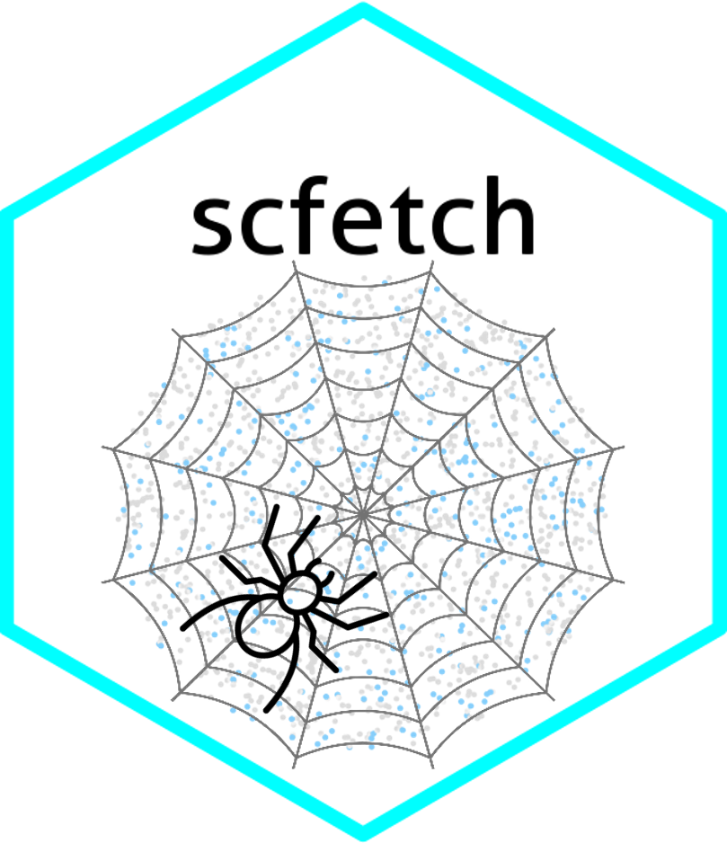
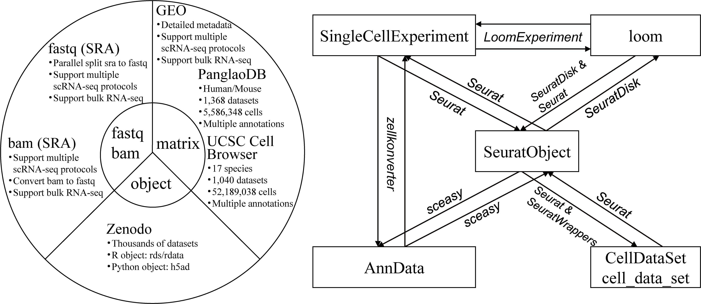

# scfetch - Access and Format Single-cell RNA-seq Datasets from Public Resources 



## Introduction

`scfetch` is designed to accelerate users download and prepare single-cell datasets from public resources. It can be used to:

* **Download fastq files** from `GEO/SRA`, **foramt fastq files** to standard style that can be identified by 10x softwares (e.g. CellRanger).
* **Download bam files** from `GEO/SRA`, support **downloading original 10x generated bam files (with custom tags) and normal bam files**, and **convert bam files to fastq files**.
* Download scRNA-seq **matrix** and **annotation (e.g. cell type)** information from `GEO`, `PanglanDB` and `UCSC Cell Browser`, **load the downnloaded matrix to `Seurat`**.
* Download processed objects from `Zeenodo` and `CELLxGENE`.
* **Object conversion between widely used single cell objects** (`SeuratObject`, `AnnData`, `SingleCellExperiment`, `CellDataSet/cell_data_set` and `loom`).

<hr />

## Framework

<div align="center">

</div>

<hr />

## Installation

You can install the development version of `scfetch` from [GitHub](https://github.com/showteeth/scfetch) with:

``` r
# install.packages("devtools")
devtools::install_github("showteeth/scfetch")
```

<hr />

## Usage
### Vignette
Detailed usage is available in [website](https://showteeth.github.io/scfetch/).

<hr />

### Function list

<table>
<thead>
  <tr>
    <th>Type</th>
    <th>Function</th>
    <th>Usage</th>
  </tr>
</thead>
<tbody>
  <tr>
    <td rowspan="3">Download and format fastq</td>
    <td>ExtractRun</td>
    <td>Extract runs with GEO accession number or GSM number</td>
  </tr>
  <tr>
    <td>DownloadSRA</td>
    <td>Download sra files</td>
  </tr>
  <tr>
    <td>SplitSRA</td>
    <td>Split sra files to fastq files and format to 10x standard style</td>
  </tr>
  <tr>
    <td rowspan="2">Download and convert bam</td>
    <td>DownloadBam</td>
    <td>Download bam (support 10x original bam)</td>
  </tr>
  <tr>
    <td>Bam2Fastq</td>
    <td>Convert bam files to fastq files</td>
  </tr>
  <tr>
    <td rowspan="9">Download matrix and load to Seurat </td>
    <td>ExtractGEOMeta</td>
    <td>Extract sample metadata from GEO</td>
  </tr>
  <tr>
    <td>ParseGEO</td>
    <td>Download matrix from GEO and load to Seurat</td>
  </tr>
  <tr>
    <td>ExtractPanglaoDBMeta</td>
    <td>Extract sample metadata from PandlaoDB</td>
  </tr>
  <tr>
    <td>ExtractPanglaoDBComposition</td>
    <td>Extract cell type composition of PanglaoDB datasets</td>
  </tr>
  <tr>
    <td>ParsePanglaoDB</td>
    <td>Download matrix from PandlaoDB and load to Seurat</td>
  </tr>
  <tr>
    <td>ShowCBDatasets</td>
    <td>Show all available datasets in UCSC Cell Browser</td>
  </tr>
  <tr>
    <td>ExtractCBDatasets</td>
    <td>Extract UCSC Cell Browser datasets with attributes</td>
  </tr>
  <tr>
    <td>ExtractCBComposition</td>
    <td>Extract cell type composition of UCSC Cell Browser datasets</td>
  </tr>
  <tr>
    <td>ParseCBDatasets</td>
    <td>Download UCSC Cell Browser datasets and load to Seurat</td>
  </tr>
  <tr>
    <td rowspan="4">Download objects</td>
    <td>ExtractZenodoMeta</td>
    <td>Extract sample metadata from Zenodo with DOIs</td>
  </tr>
  <tr>
    <td>ParseZenodo</td>
    <td>Download rds/rdata/h5ad/matrix from Zenodo with DOIs</td>
  </tr>
  <tr>
    <td>ExtractCELLxGENEMeta</td>
    <td>Extract metadata of CELLxGENE datasets with attributes</td>
  </tr>
  <tr>
    <td>ParseCELLxGENE</td>
    <td>Download rds/h5ad from CELLxGENE</td>
  </tr>
  <tr>
    <td rowspan="4">Convert between different single-cell objects</td>
    <td>ExportSeurat</td>
    <td>Convert SeuratObject to AnnData, SingleCellExperiment, CellDataSet/cell_data_set and loom</td>
  </tr>
  <tr>
    <td>ImportSeurat</td>
    <td>Convert AnnData, SingleCellExperiment, CellDataSet/cell_data_set and loom to SeuratObject</td>
  </tr>
  <tr>
    <td>SCEAnnData</td>
    <td>Convert between SingleCellExperiment and AnnData</td>
  </tr>
  <tr>
    <td>SCELoom</td>
    <td>Convert between SingleCellExperiment and loom</td>
  </tr>
</tbody>
</table>

<hr />

## Contact
For any question, feature request or bug report please write an email to [songyb0519@gmail.com](songyb0519@gmail.com).

<hr />

## Code of Conduct
  
Please note that the `scfetch` project is released with a [Contributor Code of Conduct](https://contributor-covenant.org/version/2/1/CODE_OF_CONDUCT.html). By contributing to this project, you agree to abide by its terms.

<br />


